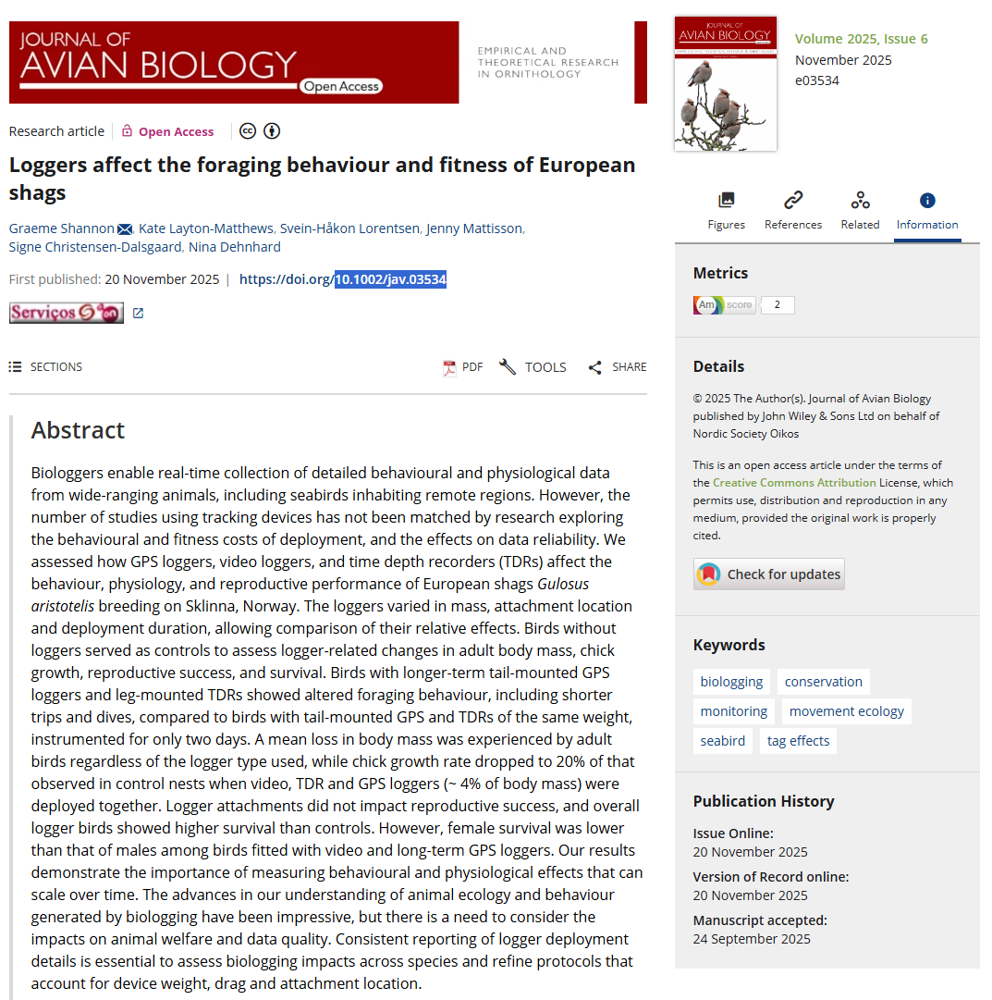

```{r setup, include=FALSE, echo=FALSE,message=FALSE, warning=FALSE}
# WARNING: DO NOT TOUCH THIS CODE
knitr::opts_chunk$set(echo = TRUE)
library(readxl)
library("lubridate")
library("mgcv")
options(scipen = 999)
# WARNING: DO NOT TOUCH THIS CODE
```

This is an example of an autocorrection assignment for Ecological Statistics.


# Instructions

Please read carefully these instructions. **There are some new bold bits you have not seen before**. Failing to do so might lead to you not having the grade you expect.

Never ever under any circumstances:

* change code that is in a chunk that starts with the comment "# do not touch this code chunk"

* change the names of objects created by the template's code

* delete any objects created by the code already on the template

* create objects with the same names as those already present in the template

You should read the assignment on its `.html` version, since that is the only way to be able to see what are some of the dynamic values that your tasks depend on. Currently, many of these dynamic values just take the default value `NA`. When you complete the assignment, if you did all you should as you were expected, there will be no longer any `NA`s shown in the output.

**Very important**: For all numeric results, do not use numbers with longer decimals, as here

```{r}
pi
```

You must round all `numerical` values to two decimal places, as here

```{r}
round(pi,2) 
```
Also, **you should make sure that numeric results are indeed numeric**. Therefore, for safety, always consider using the `as.numeric` function for safety, as in 

```{r}
as.numeric(round(pi,2))
```


**WARNING**: Failing to follow any of the above simple instructions might mean you will have a grade of 0 on the assignment.

# Before you begin

Replace the number 11111 in the next chunk with your student number.[^1]

[^1]: As you now know if you did the first assignment, the first thing you will do here is to set up a random seed, which will always be unique to you: your student number.

Compile the .Rmd after you replaced 11111 by your student number in the code chunk above. 

```{r}
#replace 11111 by your student number
naluno <- 11111
```

From now on, your results are yours alone, and you are ready to start the work itself.

# Introduction

In this assignment you will be mostly working with data from the paper

Shannon G., Layton‐Matthews K., Lorentsen S.-H., Mattisson J., Christensen‐Dalsgaard S. & Dehnhard N. 2025. Loggers affect the foraging behaviour and fitness of European shags. Journal of Avian Biology. DOI: (10.1002/jav.03534)[https://nsojournals.onlinelibrary.wiley.com/doi/full/10.1002/jav.03534]

In @Shannon2025 the authors explore how animal borne loggers impact European shags, in particular their foraging behaviour and fitness.



The pdf of the paper is on moodle under this assignment folder, so that you can look at additional details if you want. Here you will be only analysis one of the several datasets the authors provide, namely `Foraging_trip.csv`.

These are the columns descriptions, taken from the authors readme file available at the dryad repository with DOI: [10.5061/dryad.2z34tmq07](https://doi.org/10.5061/dryad.2z34tmq07). It is very good for science that scientists provide their data so that others can do additional science with those, and checking the results are correct. This is one of the ways we can make science more transparent and reproducible.

**1. Foraging behaviour (dataset: Foraging_trip.csv)**

| **Variable** | **Definition**                                 |
| :----------- | :--------------------------------------------- |
| trip\_id     | Unique ID for each recorded foraging trip      |
| sex          | Male or Female                                 |
| year         | Year                                           |
| TripComp     | Trip completed                                 |
| N            | Number of GPS locations                        |
| maxdist      | Maximum distance from the colony in metres     |
| start        | Start date and time (format: DD.MM.YYYY HH:MM) |
| end          | End date and time (format: DD.MM.YYYY HH:MM)   |
| length       | Length of trip in decimal hours                |
| tag          | Type of logger used (IgotU, pathT or video)    |
| duration     | Time since the logger was deployed in days     |

Each record corresponds to a foraging trip.

# Reading the data

Read the data in the next code chunk, naming the object that will hold the data `shagsALL`.

```{r}
#this code should be a single line of code
# this is the only code chunk you edit in this section
shagsALL <- NA
# once you have read the data with your own code in the line above, 
# delete the line of code just below here, which is there just so that this 
# document compiles before you do assignment
shagsALL <- data.frame(N=1:10000,shags=NA)
```

# Don't touch this (section)

Nothing in this section is to be touched. Therefore, just... don't.

You are not supposed to understand what this code is doing, so if you do not, that's absolutely fine.

The code is simply generating datasets that are unique to you, which you will then work on in the next sections.

Here we pretend the hard work the authors had in the field was jeopardized by a lack of backups. A file became corrupted and some of the data was lost. Never forget, do not be these people: always have data backups!

```{r}
set.seed(naluno)
n <- round(runif(1,1000,nrow(shagsALL)))
shagsR <- shagsALL[sample(1:nrow(shagsALL),size = n,replace=FALSE),]
```

The file with the records that were recovered is `shagsR`. This is the data you will work on, unless you are explicitly told otherwise.

The original dataset had `r nrow(shagsALL)` records. Your dataset is now a random subset of those observations, stored in an object named `shagsR`, of class `r class(shagsR)`. If this worked fine it should be a `data.frame`.

```{r,echo=FALSE}
# do not touch this code chunk
n <- round(runif(1,900,nrow(shagsALL)))
yr <- sample(1:nrow(shagsALL),size = n,replace=FALSE)
# some other data
shagsy <- shagsALL[yr,]
# a sample for one of the exercises
n2 <- round(runif(1,20,30))
# your significance values
sig1 <- sample(c(0.1,0.05,0.01,0.2,0.0001,0.001,0.07,0.32),size = 1)
sig2 <- sample(c(0.1,0.05,0.01,0.2,0.0001,0.001,0.07,0.32),size = 1)
```

# Your shags analysis

## Optional

This subsection is optional, but since you learn by doing, I recommend you do it!

Any statistical tests or models should only be implemented after a thorough exploration of the data. 

Feel free to explore the data in `shagsR`. If you produce any interesting insights from an exploratory data analysis - i.e. without using any tests, just data visualizations - describe them below. These can be used later if you want to convince me you worked extra hard ;)

```{r}
# makes some plots about the data
# draw some conclusions from them
```

## Mandatory

How many records were not destroyed?

```{r}
# replace the value NA with an expression that 
# returns the desired value
result1 <- NA
```

A total of `r result1` records were not destroyed.

What was the proportion of the data that was lost, in terms of the number of records?

```{r}
# replace the value NA with an expression that 
# returns the desired value
result2 <- NA

```
The proportion of the data that was lost was `r result2`.

Represent in a figure the number of records per tag type. What was the tag type with the largest number of records?

```{r}
# replace the value NA with an expression that 
# returns the desired value 
result3 <- NA
```

The tag type with the largest number of records was `r result3`.

Evaluate if the distribution of the tag types is the same across years. What is the value of the test statistic of the adequate statistical test to do so?

```{r}
result4 <- NA
```
The value of the test statistic is `r result4`.

What is the decision if you consider the significance level of `r sig1`

```{r}
result5 <- NA
# uncomment the line that is correct for your dataset
#result5 <- "reject H0"
#result5 <- "not reject H0"
#result5 <- "accept H0"
#result5 <- "accept H1"
```

At the significance level of `r sig1` we should `r result5`.

How might this result influence the results of comparisons across different tag types?

Is there a relation between the maximum distance and the length of the trip? Make a suitable plot that looks at this relation, add a minimum square line to the plot, and calculate the correlation between the two variables, which you should add to the plot

```{r}
# add the correlation between the two variables here
result6 <- NA
```

The linear correlation between the two variables is `r result6`.

Do you reject or do you not reject the null hypothesis that the correlation is 0 at the level of significance `r sig2`?

```{r}
# add your decision here
# comment this line and then
result7 <- NA
# uncomment the line that is correct for your dataset
#result7 <- "reject H0"
#result7 <- "not reject H0"
#result7 <- "accept H0"
#result7 <- "accept H1"
```

At the significance level of `r sig2` we should `r result7`.

How do you interpret this relation?

Model the length of the trip as a function of the tag, sex and year, using a GLM with one of the following distributions for the family: (1) Gaussian, (2) Poisson, (3) beta, (4) Gamma or (5) binomial. Irrespective of the family chosen, consider a log-link function. Also, despite that being a dubious procedure, consider the year as a continuous variable. Call the fitted model `model.length`.

Ignoring interactions, does sex influence the response, at the significance level `r sig1`?

```{r}
# add your decision here
# comment this line and then 
result8 <- NA
# uncomment the line that is correct for your dataset
#result8 <- "reject H0"
#result8 <- "not reject H0"
#result8 <- "accept H0"
#result8 <- "accept H1"
```

At the significance level of `r sig1`, for sex, we should `r result8`.

What about the year?

```{r}
# add your decision here
# comment this line and then 
result9 <- NA
# uncomment the line that is correct for your dataset
#result9 <- "reject H0"
#result9 <- "not reject H0"
#result9 <- "accept H0"
#result9 <- "accept H1"
```

At the significance level of `r sig1`, for year, we should `r result9`.

Given your model, what will be the predicted value for the length of a trip for a female, in 2021, with a tag of the type `pathT`.

```{r}
result10 <- NA
```

The predicted value is `r round(result10,2)`.

Why is it that year might not be well represented by a continuous variable? In such a case, what should it be considered?

```{r}
# add your decision here
# comment this line and then 
result11 <- NA
# uncomment the line that is correct for your dataset
# result11 <- "logical"
# result11 <- "numeric"
# result11 <- "factor"
# result11 <- "binary"
```

Year should be considered as a `r result11` variable. Why is that?

# Passive acoustic monitoring

The dataset in file `MMSL2R_FINAL_202505.csv` was used in @Taylor2025 to assess the yearly occurrence of cetaceans at a single location in Australia. Each row in the dataset corresponds to a single record and (here we assume) all records have the same duration. 


Read the data in the next code chunk, naming the object that will hold the data `taylor`.

```{r}
#this code should be a single line of code
# this is the only code chunk you edit in this section
taylor <- NA
# once you have read the data with your own code in the line above, 
# delete the line of code just below here, which is there just so that this 
# document compiles before you do assignment
taylor <- data.frame(N=1:10000,pam=NA)
```

## Don't touch this (section) either

Nothing in this section is to be touched. Therefore, just... don't. You are not necessarily supposed to understand what this code is doing, so if you do not, that is absolutely fine. The code is simply generating datasets that are unique to you, which you will then work on in the next sections.

Here we again pretend the hard work the authors had in the field was jeopardized by a lack of backups. The file became corrupted and some of the data was lost. This cautionary tale can't be stressed enough: always have data backups!

```{r}
set.seed(naluno)
corrupted <- sample(1:nrow(taylor),size = 100,replace=FALSE)
taylorR <- taylor[-corrupted,]
sps <- c("Dolphin","Minke","Humpback")
mysp <- sample(sps,1)
# a couple of random days of the year
julian_days <- sample(1:365,2,replace = FALSE)  # example Julian day
date1 <- as.Date(julian_days[1], origin = "2025-01-01")
mymon1 <- month(date1)
monname1 <- month.name[mymon1]
myday1 <- day(date1)
date2 <- as.Date(julian_days[2], origin = "2025-01-01")
mymon2 <- month(date2)
monname2 <- month.name[mymon2]
myday2 <- day(date2)
```

## Your PAM analysis

What is the most frequent species to occur at this site?

```{r}
# add your decision here
# comment this line and then 
result12 <- NA
```

The most frequent species to occur is `r result12`.

Now fit a model to the data to predict the presence of `r mysp` as a function of the day of the year (DOY). Call it `mymod`. Select the most appropriate model components from the options below:

```{r}
# model
# 1. lm
# 2. glm
# 3. gam
# family
# 1. gaussian
# 2. beta
# 3. gamma
# 4. poisson
# 5. binomial
# 6. negative binomial
# link function
# 1. identity
# 2. log
# 3. logit
# 4. cloglog
# 5. inverse
```

tip: if you obtain warning messages regarding convergence problems, in particular if you are using a model that allows for non-linearity, try to restrain the wiggliness of the model by setting the maximum number of degrees of freedom in your smooth. Something like `s(X,k=6)` should work.

Predict the probability of presence of `r mysp`, for a non-leap year, on `r monname1` `r  myday1`:

```{r}
# probability of presence goes here
result13 <- NA
```

The predicted probability is `r result13`. And the same prediction on `r monname2` `r  myday2`:

```{r}
# probability of presence goes here
result14 <- NA
```

The predicted probability is `r result14`.

For these two specific days, what is the Julian day for which that probability is the highest?

```{r}
# replace the NA with the correct Julian day
result15 <- NA
```

```{r}
# DO NOT TOUCH THIS CODE CHUNK
date.maxp <- as.Date(result15-1, origin = "2025-01-01")
mymon.maxp <- month(date.maxp)
monname.maxp <- month.name[mymon.maxp]
myday.maxp <- day(date.maxp)
```


That happens to be for Julian day `r result15`, or in other words `r monname.maxp` `r  myday.maxp`.

# Very important: do not touch the code below

Do not touch the code below, as it produces a file with all your answers, that you will submit to moodle. Also, do NOT touch the .txt file that gets produced when you compile the document.

You are required to submit 3 files:

* An `.Rmd` file named `HandInT3_N11111.Rmd` [^4]
* The two files created when you compile the .Rmd file
    - the `.docx` file named `HandInT3_N11111.docx` (note this means you have to compile the .Rmd, i.e. to knit it, to word!)
    - the `.txt` file `ResT3_N11111.txt` (This `.txt `file has a format that you do not need to understand, please do not touch this file; failing to follow this instruction could mean you have a grade of 0)

where in the 3 file names the 11111 will be your student number[^5].

[^4]: For reasons beyond my imagination in some computers this file might appear under Windows explorer as a file of type `R HTML file`. It is NOT an HTML file, but an .Rmd file.

[^5]: Your student number is added by default to the .txt file, but you need to add it manually to the .Rmd and .html files by renaming the files.

```{r,echo=FALSE}
#number of results
nq <- 15
myanswers <- list(naluno)
for(i in 1:nq){
  myanswers[[i+1]] <- eval(parse(text=paste0("result",i)))
}
#replace the X with the assignment number
dput(myanswers,file=paste0("ResT3_N",naluno,".txt"))
```

# References